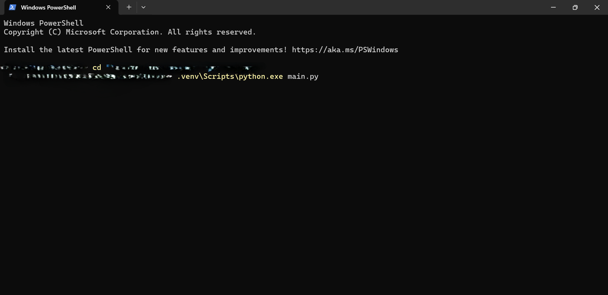
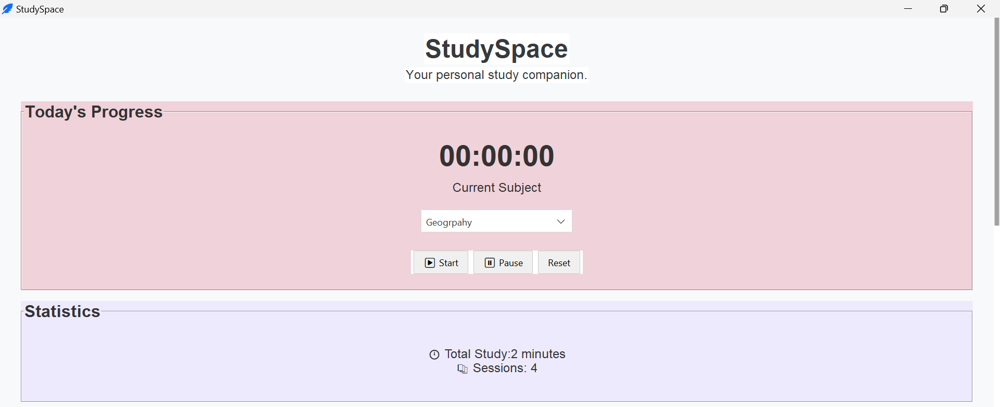
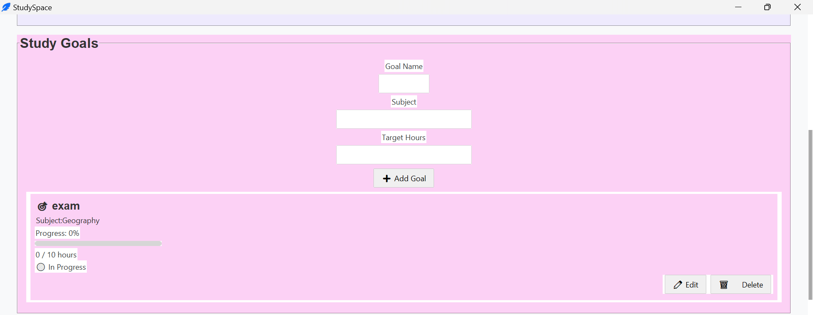
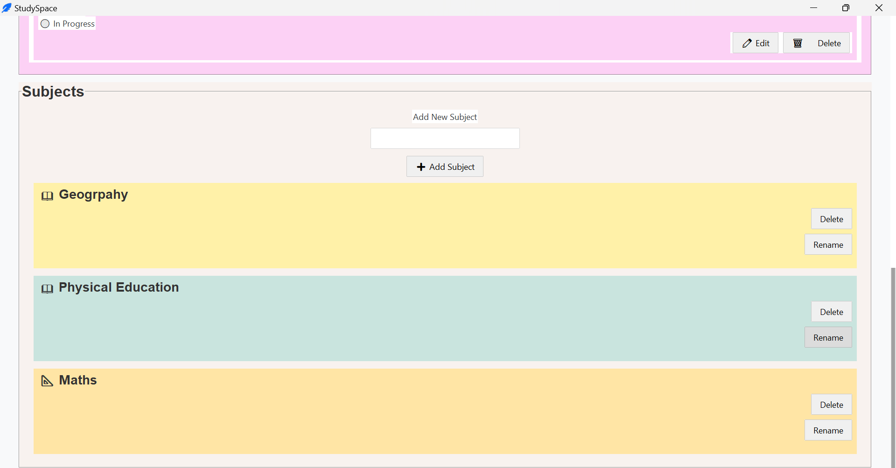

# StudySpace 📚

A personal study companion built with Python and Tkinter.

## Features

- ⏱️ Study timer
- 📚 Subject management
- 🎯 Study goals tracking
- 📊 Study statistics
- 💾 Local data storage using JSON
- ✏️ Edit and delete goals
- 📜 Full page scrolling

## Technologies

- Python
- Tkinter
- ttkbootstrap
- JSON

## How to Run

1. git clone https://github.com/ollyyy111/StudySpace.git

2. Open the project folder
   cd "paste the study space path address here" 

3 Create a virtual environment  
   python -m venv .venv

4 Activate the virtual environment
    .venv/Scripts/activate  
  MAC/LINUX
    source.venv/bin/activate

5 Install depemdencies 
    pip install -r requirements.txt

6 Run  
    after activating type
        python main.py

OR directly activate the virtual environment by typing 
     .venv/Scripts/python.exe main.py         

## Future Improvements

- Notes system
- Timetable
- Flashcards
- Dark mode

## Screenshots
  
   ## Running
   

   ## Progress 
   

   ## Stats
   

   ## Subjects
   
